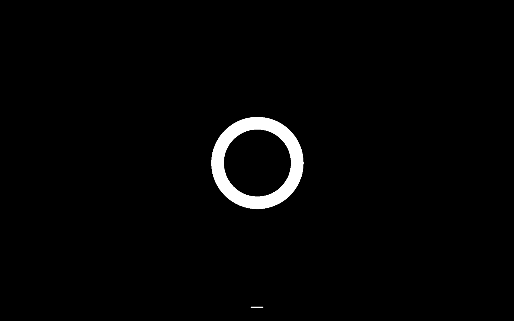

# billynabil DESIGN.md

> Auto-generated design system — reverse-engineered via static analysis by skillui.
> Frameworks: None detected
> Colors: 20 · Fonts: 3 · Components: 0
> Icon library: not detected · State: not detected
> Primary theme: light · Dark mode toggle: no · Motion: expressive

## Visual Reference

**Match this design exactly** — study colors, fonts, spacing, and component shapes before writing any UI code.



---

## 1. Visual Theme & Atmosphere

This is a **light-themed** interface with a warm, approachable feel. The light background emphasizes content clarity. Typography pairs **Syne** for display/headings with **Manrope** for body text, creating clear visual hierarchy through type contrast. Spacing follows a **4px base grid** (compact density), with scale: 4, 8, 12, 16, 20, 24, 28, 32px. The accent color **#2a0a0a** anchors interactive elements (buttons, links, focus rings). Motion is expressive — spring physics, layout animations, and staggered reveals are part of the visual language.

---

## 2. Color Palette & Roles

| Token | Hex | Role | Use |
|---|---|---|---|
| color-black | `#000000` | surface | Card and panel backgrounds |
| tw-ring-offset-color | `#ffffff` | text-primary | Headings and body text |
| secondary | `#1a0505` | text-primary | Headings and body text |
| color-gray-400 | `#99a1af` | text-muted | Captions, placeholders, secondary info |
| accent | `#2a0a0a` | accent | CTAs, links, focus rings, active states |
| color-purple-500 | `#ac4bff` | accent | CTAs, links, focus rings, active states |
| color-red-600 | `#e40014` | danger | Error states, destructive actions |
| color-blue-500 | `#3080ff` | info | Informational highlights |
| color-neutral-950 | `#0a0a0a` | unknown | Palette color |
| color-red-500 | `#fb2c36` | unknown | Palette color |
| ring | `#660a0a` | unknown | Palette color |
| color-purple-400 | `#c07eff` | unknown | Palette color |
| color-pink-500 | `#f6339a` | unknown | Palette color |
| color-slate-700 | `#314158` | unknown | Palette color |
| color-slate-800 | `#1d293d` | unknown | Palette color |
| color-slate-900 | `#0f172b` | unknown | Palette color |
| color-gray-300 | `#d1d5dc` | unknown | Palette color |
| color-neutral-900 | `#171717` | unknown | Palette color |
| unknown | `#1da1f2` | unknown | Palette color |
| unknown | `#5865f2` | unknown | Palette color |

### CSS Variable Tokens

```css
--tw-border-style: solid;
--tw-border-style: dashed;
--tw-border-style: none;
--background: #020000;
--foreground: #fff;
--card: #0a0000;
--card-foreground: #fff;
--popover: #0a0000;
--popover-foreground: #fff;
--primary: #e60022;
--primary-foreground: #fff;
--secondary: #1a0505;
--secondary-foreground: #fff;
--muted: #1a0505;
--muted-foreground: #888;
--accent: #2a0a0a;
--accent-foreground: #fff;
--destructive: #900;
--destructive-foreground: #fff;
--border: #330a0a;
```


---

## 3. Typography Rules

**Font Stack:**
- **Manrope** — Heading 1, Heading 2, Heading 3
- **Syne** — Body, Caption
- **SFMono-Regular** — Code

**Font Sources:**

```css
@font-face {
  font-family: "Syne";
  src: url("fonts/Syne-Bold.ttf") format("truetype");
  font-weight: 700;
}
@font-face {
  font-family: "Syne";
  src: url("fonts/Syne-Regular.ttf") format("truetype");
  font-weight: 400;
}
@font-face {
  font-family: "Manrope";
  src: url("fonts/Manrope-Bold.ttf") format("truetype");
  font-weight: 700;
}
@font-face {
  font-family: "Manrope";
  src: url("fonts/Manrope-Regular.ttf") format("truetype");
  font-weight: 400;
}
@font-face {
  font-family: "Oswald";
  src: url("fonts/Oswald-Bold.ttf") format("truetype");
  font-weight: 700;
}
@font-face {
  font-family: "Oswald";
  src: url("fonts/Oswald-Regular.ttf") format("truetype");
  font-weight: 400;
}
```

| Role | Font | Size | Weight |
|---|---|---|---|
| Heading 1 | Manrope | 6rem | 700 |
| Heading 2 | Manrope | 10px | 700 |
| Heading 3 | Manrope | 9px | 700 |
| Body | Syne | inherit | 400 |
| Caption | Syne | 1em | 400 |
| Code | SFMono-Regular | 14px | 400 |

**Typographic Rules:**
- Limit to 3 font families max per screen
- Use **Manrope** for body/UI text, **Syne** for display/headings
- Maintain consistent hierarchy: no more than 3-4 font sizes per screen
- Headings use bold (600-700), body uses regular (400)
- Line height: 1.5 for body text, 1.2 for headings
- Use color and opacity for secondary hierarchy, not additional font sizes


---

## 4. Component Stylings

No components detected. Scan `src/components/` or `components/` to populate this section.

---

## 5. Layout Principles

- **Base spacing unit:** 4px
- **Spacing scale:** 4, 8, 12, 16, 20, 24, 28, 32, 36, 40, 44, 48
- **Border radius:** .25rem, 3px, 4px
- **Max content width:** 1024px

**Spacing as Meaning:**
| Spacing | Use |
|---|---|
| 4-8px | Tight: related items within a group |
| 12-16px | Medium: between groups |
| 24-32px | Wide: between sections |
| 48px+ | Vast: major section breaks |


---

## 6. Depth & Elevation

No box-shadow values detected. The design appears to use a flat visual style.

**Z-Index Scale:** `0, 1, 2, 10, 20, 50, 9998, 9999, 10000, 99999`


---

## 7. Animation & Motion

This project uses **expressive motion**. Animations are an integral part of the experience.

### CSS Animations

- `@keyframes shimmer`
- `@keyframes shimmer-firefox`
- `@keyframes spin`
- `@keyframes fadeIn`
- `@keyframes scrollUp`
- `@keyframes scrollDown`
- `@keyframes scrollLeft`
- `@keyframes scrollRight`

### Motion Guidelines

- Duration: 150-300ms for micro-interactions, 300-500ms for page transitions
- Easing: `ease-out` for enters, `ease-in` for exits
- Always respect `prefers-reduced-motion`


---

## 8. Do's and Don'ts

### Do's

- Use `#2a0a0a` for interactive elements (buttons, links, focus rings)
- Pair **Manrope** (body) with **Syne** (display) — these are the only allowed fonts
- Follow the **4px** spacing grid for all margins, padding, and gaps
- Use border and background shifts for elevation — not shadows
- Use border-radius from the scale: .25rem, 3px, 4px

### Don'ts

- Don't introduce colors outside this palette — extend the design tokens first
- Don't introduce additional font families beyond Manrope and Syne and SFMono-Regular
- Don't use arbitrary spacing values — stick to multiples of 4px
- Don't add box-shadow — this design system uses flat elevation
- Don't use arbitrary border-radius values — pick from the defined scale
- Don't use backdrop-blur or blur effects

### Anti-Patterns (detected from codebase)

- No box-shadow on any element
- No blur or backdrop-blur effects
- No zebra striping on tables/lists


---

## 9. Responsive Behavior

| Name | Value | Source |
|---|---|---|
| sm | 40rem | css |
| md | 48rem | css |
| lg | 64rem | css |
| xl | 80rem | css |
| 2xl | 96rem | css |
| md | 768px | css |

**Approach:** Use `@media (min-width: ...)` queries matching the breakpoints above.


---

## 10. Agent Prompt Guide

Use these as starting points when building new UI:

### Build a Card

```
Background: #000000
Border: 1px solid var(--border)
Radius: 3px
Padding: 16px
Font: Manrope
No shadows — use borders and surface colors for depth.
```

### Build a Button

```
Primary: bg #2a0a0a, text white
Ghost: bg transparent, border var(--border)
Padding: 8px 16px
Radius: 3px
Hover: opacity 0.9 or lighter shade
Focus: ring with #2a0a0a
```

### Build a Page Layout

```
Background: var(--background)
Max-width: 1024px, centered
Grid: 4px base
Responsive: mobile-first, breakpoints from Section 9
```

### Build a Stats Card

```
Surface: #000000
Label: #99a1af (muted, 12px, uppercase)
Value: #ffffff (primary, 24-32px, bold)
Status: use success/warning/danger from Section 2
```

### Build a Form

```
Input bg: var(--background)
Input border: 1px solid var(--border)
Focus: border-color #2a0a0a
Label: #99a1af 12px
Spacing: 16px between fields
Radius: 3px
```

### General Component

```
1. Read DESIGN.md Sections 2-6 for tokens
2. Colors: only from palette
3. Font: Manrope, type scale from Section 3
4. Spacing: 4px grid
5. Components: match patterns from Section 4
6. Elevation: flat, surface shifts
```
