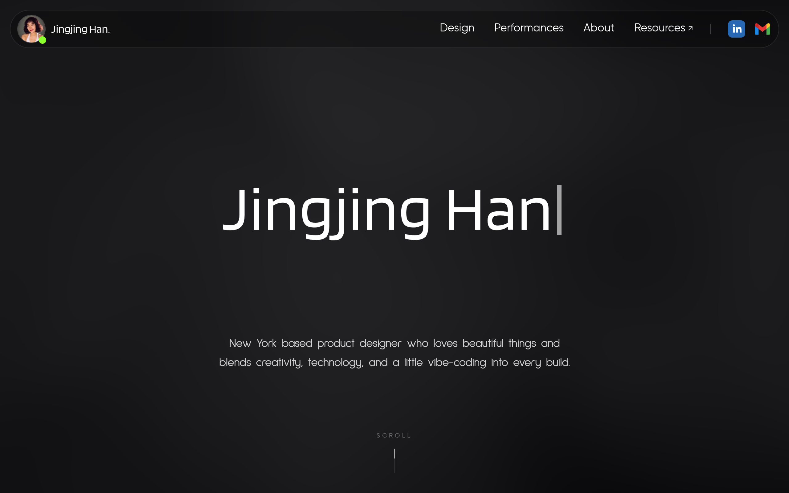

# jingjinghan Design System

You are building UI for **jingjinghan**. Light-themed, cool palette, sans-serif typography (Sulphur Point), compact density on a 4px grid, expressive motion.

## Visual Reference

**IMPORTANT**: Study ALL screenshots below before writing any UI. Match colors, typography, spacing, layout, and motion exactly as shown.

### Homepage



> Read `references/DESIGN.md` for full token details.

## Design Philosophy

- **Layered depth** — use shadow tokens to create a sense of physical layering. Each elevation level has a specific shadow.
- **Gradient accents** — gradients are used thoughtfully for emphasis, not decoration.
- **Type pairing** — Sulphur Point for body/UI text, Blinker for headings/display. Never introduce a third typeface.
- **compact density** — 4px base grid. Every dimension is a multiple of 4.
- **cool palette** — the color temperature runs cool, matching the sans-serif typography.
- **Restrained accent** — `#90c5ff` is the only pop of color. Used exclusively for CTAs, links, focus rings, and active states.
- **Expressive motion** — animations are an integral part of the experience. Use spring physics and layout animations.

## Color System

### Core Palette

| Role | Token | Hex | Use |
|------|-------|-----|-----|
| Background | `--background` | `#ffffff` | Page/app background |
| Surface | `--surface` | `#f5f5f5` | Cards, panels, modals |
| Text Primary | `--text-primary` | `#000000` | Headings, body text |
| Text Muted | `--text-muted` | `#a1a1a1` | Captions, placeholders |
| Accent | `--accent` | `#90c5ff` | CTAs, links, focus rings |
| Border | `--border` | `#262626` | Dividers, card borders |

### Status Colors

| Status | Hex | Use |
|--------|-----|-----|
| Success | `#28c840` | Confirmations, positive trends |
| Warning | `#febc2e` | Caution states, pending items |

### Extended Palette

- **color-neutral-950:** `#0a0a0a` — Deep background layer or shadow color
- **color-neutral-200:** `#e5e7eb` — Light surface or highlight color
- **color-neutral-300:** `#d4d4d4`
- **color-blue-600:** `#155dfc`
- `#5eead4`
- **color-cyan-200:** `#a2f4fd`
- **color-blue-200:** `#bedbff`
- **color-neutral-900:** `#171717` — Deep background layer or shadow color

### CSS Variable Tokens

```css
--radius-card: 18px;
--background: #000;
--foreground: #fff;
--muted-ink: #ababab;
--accent-green: #8cff2e;
--accent: #fff;
--radius-card: 18px;
--background: #000;
--foreground: #fff;
--muted-ink: #ababab;
--accent-green: #8cff2e;
--accent: #fff;
--radius-card: 18px;
--background: #000;
--foreground: #fff;
--muted-ink: #ababab;
--accent-green: #8cff2e;
--accent: #fff;
--radius-card: 18px;
--background: #000;
```

## Typography

### Font Stack

- **Sulphur Point** — Heading 1, Heading 2, Heading 3
- **Blinker** — Body, Caption
- **SFMono-Regular** — Code

### Font Sources

```css
@font-face {
  font-family: "Blinker";
  src: url("fonts/Blinker-Bold.ttf") format("truetype");
  font-weight: 700;
}
@font-face {
  font-family: "Blinker";
  src: url("fonts/Blinker-Regular.ttf") format("truetype");
  font-weight: 400;
}
@font-face {
  font-family: "Sulphur Point";
  src: url("fonts/SulphurPoint-Bold.ttf") format("truetype");
  font-weight: 700;
}
@font-face {
  font-family: "Sulphur Point";
  src: url("fonts/SulphurPoint-Regular.ttf") format("truetype");
  font-weight: 400;
}
@font-face {
  font-family: "gilroy";
  src: url("fonts/gilroy-Regular.woff2") format("woff2");
  font-weight: 400;
}
```

### Type Scale

| Role | Family | Size | Weight |
|------|--------|------|--------|
| Heading 1 | Sulphur Point | 96px | 700 |
| Heading 2 | Sulphur Point | 72px | 700 |
| Heading 3 | Sulphur Point | clamp(64px,15vw,220px) | 700 |
| Body | Blinker | 22px | 400 |
| Caption | Blinker | 20px | 400 |
| Code | SFMono-Regular | 14px | 400 |

### Typography Rules

- Body/UI: **Sulphur Point**, Headings: **Blinker** — these are the only display fonts
- Max 3-4 font sizes per screen
- Headings: weight 600-700, body: weight 400
- Use color and opacity for text hierarchy, not additional font sizes
- Line height: 1.5 for body, 1.2 for headings

## Spacing & Layout

### Base Grid: 4px

Every dimension (margin, padding, gap, width, height) must be a multiple of **4px**.

### Spacing Scale

`2, 4, 8, 10, 40, 46, 48, 72` px

### Spacing as Meaning

| Spacing | Use |
|---------|-----|
| 4-8px | Tight: related items (icon + label, avatar + name) |
| 12-16px | Medium: between groups within a section |
| 24-32px | Wide: between distinct sections |
| 48px+ | Vast: major page section breaks |

### Border Radius

Scale: `.25rem, 10px, 14px, 16px, 18px, 20px, 24px, 26px, 28px, 30px, inherit, 22px`
Default: `24px`

### Container

Max-width: `1400px`, centered with auto margins.

### Breakpoints

| Name | Value |
|------|-------|
| sm | 40rem |
| md | 48rem |
| lg | 64rem |
| xl | 80rem |
| 2xl | 96rem |

Mobile-first: design for small screens, layer on responsive overrides.

## Component Patterns

### Card

```css
.card {
  background: #f5f5f5;
  border: 1px solid #262626;
  border-radius: 24px;
  padding: 10px;
  box-shadow: 0 34px 70px -34px #000000d9;
}
```

```html
<div class="card">
  <h3>Card Title</h3>
  <p>Card content goes here.</p>
</div>
```

### Button

```css
/* Primary */
.btn-primary {
  background: #90c5ff;
  color: #000000;
  border-radius: 24px;
  padding: 8px 10px;
  font-weight: 500;
  transition: opacity 150ms ease;
}
.btn-primary:hover { opacity: 0.9; }

/* Ghost */
.btn-ghost {
  background: transparent;
  border: 1px solid #262626;
  color: #000000;
  border-radius: 24px;
  padding: 8px 10px;
}
```

```html
<button class="btn-primary">Get Started</button>
<button class="btn-ghost">Learn More</button>
```

### Input

```css
.input {
  background: #ffffff;
  border: 1px solid #262626;
  border-radius: 24px;
  padding: 8px 10px;
  color: #000000;
  font-size: 14px;
}
.input:focus { border-color: #90c5ff; outline: none; }
```

```html
<input class="input" type="text" placeholder="Search..." />
```

### Badge / Chip

```css
.badge {
  display: inline-flex;
  align-items: center;
  padding: 4px 8px;
  border-radius: 9999px;
  font-size: 12px;
  font-weight: 500;
  background: #f5f5f5;
  color: #a1a1a1;
}
```

```html
<span class="badge">New</span>
<span class="badge">Beta</span>
```

### Modal / Dialog

```css
.modal-backdrop { background: rgba(0, 0, 0, 0.6); }
.modal {
  background: #f5f5f5;
  border: 1px solid #262626;
  border-radius: 22px;
  padding: 10px;
  max-width: 480px;
  width: 90vw;
  box-shadow: 0 34px 70px -34px #000000d9;
}
```

```html
<div class="modal-backdrop">
  <div class="modal">
    <h2>Dialog Title</h2>
    <p>Dialog content.</p>
    <button class="btn-primary">Confirm</button>
    <button class="btn-ghost">Cancel</button>
  </div>
</div>
```

### Table

```css
.table { width: 100%; border-collapse: collapse; }
.table th {
  text-align: left;
  padding: 8px 10px;
  font-weight: 500;
  font-size: 12px;
  color: #a1a1a1;
  text-transform: uppercase;
  letter-spacing: 0.05em;
  border-bottom: 1px solid #262626;
}
.table td {
  padding: 10px;
  border-bottom: 1px solid #262626;
}
```

```html
<table class="table">
  <thead><tr><th>Name</th><th>Status</th><th>Date</th></tr></thead>
  <tbody>
    <tr><td>Item One</td><td>Active</td><td>Jan 1</td></tr>
    <tr><td>Item Two</td><td>Pending</td><td>Jan 2</td></tr>
  </tbody>
</table>
```

### Navigation

```css
.nav {
  display: flex;
  align-items: center;
  gap: 8px;
  padding: 10px 10px;
  border-bottom: 1px solid #262626;
}
.nav-link {
  color: #a1a1a1;
  padding: 8px 10px;
  border-radius: 24px;
  transition: color 150ms;
}
.nav-link:hover { color: #000000; }
.nav-link.active { color: #90c5ff; }
```

```html
<nav class="nav">
  <a href="/" class="nav-link active">Home</a>
  <a href="/about" class="nav-link">About</a>
  <a href="/pricing" class="nav-link">Pricing</a>
  <button class="btn-primary" style="margin-left: auto">Get Started</button>
</nav>
```

### Extracted Components

These components were found in the codebase:

**Button** (`html`)

**Navigation** (`html`)

**Footer** (`html`)

## Page Structure

The following page sections were detected:

- **Navigation** — Top navigation bar (4 items)
- **Hero** — Hero/banner section with headline and CTAs
- **Footer** — Page footer with links and info (9 items)
- **Cta** — Call-to-action section
- **Cards** — Grid of 7 card elements (7 items)

When building pages, follow this section order and structure.

## Animation & Motion

This project uses **expressive motion**. Animations are part of the design language.

### CSS Animations

- `smoke-drift`
- `smoke-drift-2`
- `subtitle-fade`
- `scroll-cue`
- `caret-blink`

### Motion Tokens

- **Duration scale:** `.2s`, `.3s`, `.5s`, `.6s`, `.7s`, `300ms`, `350ms`, `400ms`
- **Easing functions:** `cubic-bezier(.22,1,.36,1)`
- **Animated properties:** `width`, `height`, `background-color`

### Motion Guidelines

- **Duration:** Use values from the duration scale above. Short (.2s) for micro-interactions, long (400ms) for page transitions
- **Easing:** Use `cubic-bezier(.22,1,.36,1)` as the default easing curve
- **Direction:** Elements enter from bottom/right, exit to top/left
- **Reduced motion:** Always respect `prefers-reduced-motion` — disable animations when set

## Depth & Elevation

### Shadow Tokens

- Overlay (modals, dialogs): `0 34px 70px -34px #000000d9`

### Z-Index Scale

`0, 10, 20, 30, 40, 100, 120, 150, 195, 200, 300`

Use these exact values — never invent z-index values.

## Anti-Patterns (Never Do)

- **No blur effects** — no backdrop-blur, no filter: blur()
- **No zebra striping** — tables and lists use borders for separation
- **No invented colors** — every hex value must come from the palette above
- **No arbitrary spacing** — every dimension is a multiple of 4px
- **No extra fonts** — only Sulphur Point and Blinker and SFMono-Regular are allowed
- **No arbitrary border-radius** — use the scale: .25rem, 10px, 14px, 16px, 18px, 20px, 24px, 26px, 28px, 30px
- **No opacity for disabled states** — use muted colors instead

## Workflow

1. **Read** `references/DESIGN.md` before writing any UI code
2. **Pick colors** from the Color System section — never invent new ones
3. **Set typography** — Sulphur Point, Blinker, SFMono-Regular only, using the type scale
4. **Build layout** on the 4px grid — check every margin, padding, gap
5. **Match components** to patterns above before creating new ones
6. **Apply elevation** — use shadow tokens
7. **Validate** — every value traces back to a design token. No magic numbers.

## Brand Spec

- **Favicon:** `/favicon.ico`
- **Site URL:** `https://www.jingjinghan.com/`
- **Brand color:** `#90c5ff`
- **Brand typeface:** Sulphur Point

## Quick Reference

```
Background:     #ffffff
Surface:        #f5f5f5
Text:           #000000 / #a1a1a1
Accent:         #90c5ff
Border:         #262626
Font:           Sulphur Point
Spacing:        4px grid
Radius:         24px
Components:     9 detected
```

## When to Trigger

Activate this skill when:
- Creating new components, pages, or visual elements for jingjinghan
- Writing CSS, Tailwind classes, styled-components, or inline styles
- Building page layouts, templates, or responsive designs
- Reviewing UI code for design consistency
- The user mentions "jingjinghan" design, style, UI, or theme
- Generating mockups, wireframes, or visual prototypes

---

# Full Reference Files

> Every output file is embedded below. Claude has full design system context from /skills alone.

## Design System Tokens (DESIGN.md)

# jingjinghan DESIGN.md

> Auto-generated design system — reverse-engineered via static analysis by skillui.
> Frameworks: None detected
> Colors: 20 · Fonts: 3 · Components: 9
> Icon library: not detected · State: not detected
> Primary theme: light · Dark mode toggle: no · Motion: expressive

## Visual Reference

**Match this design exactly** — study colors, fonts, spacing, and component shapes before writing any UI code.


---

## 1. Visual Theme & Atmosphere

This is a **light-themed** interface with a cool, approachable feel. The light background emphasizes content clarity. Typography pairs **Blinker** for display/headings with **Sulphur Point** for body text, creating clear visual hierarchy through type contrast. Spacing follows a **4px base grid** (compact density), with scale: 2, 4, 8, 10, 40, 46, 48, 72px. The accent color **#90c5ff** anchors interactive elements (buttons, links, focus rings). Motion is expressive — spring physics, layout animations, and staggered reveals are part of the visual language.

---

## 2. Color Palette & Roles

| Token | Hex | Role | Use |
|---|---|---|---|
| tw-ring-offset-color | `#ffffff` | background | Page background, darkest surface |
| color-neutral-100 | `#f5f5f5` | surface | Card and panel backgrounds |
| color-black | `#000000` | text-primary | Headings and body text |
| color-neutral-400 | `#a1a1a1` | text-muted | Captions, placeholders, secondary info |
| color-neutral-800 | `#262626` | border | Dividers, card borders, outlines |
| color-blue-300 | `#90c5ff` | accent | CTAs, links, focus rings, active states |
| accent-green | `#8cff2e` | accent | CTAs, links, focus rings, active states |
| success | `#28c840` | success | Success states, positive indicators |
| warning | `#febc2e` | warning | Warning states, caution indicators |
| color-blue-600 | `#155dfc` | info | Informational highlights |
| color-neutral-950 | `#0a0a0a` | unknown | Palette color |
| color-neutral-200 | `#e5e7eb` | unknown | Palette color |
| color-neutral-300 | `#d4d4d4` | unknown | Palette color |
| unknown | `#5eead4` | unknown | Palette color |
| color-cyan-200 | `#a2f4fd` | unknown | Palette color |
| color-blue-200 | `#bedbff` | unknown | Palette color |
| color-neutral-900 | `#171717` | unknown | Palette color |
| color-neutral-500 | `#737373` | unknown | Palette color |
| color-neutral-600 | `#525252` | unknown | Palette color |
| color-neutral-700 | `#404040` | unknown | Palette color |

### CSS Variable Tokens

```css
--tw-border-style: solid;
--radius-card: 18px;
--tw-border-style: dashed;
--background: #000;
--foreground: #fff;
--muted-ink: #ababab;
--accent-green: #8cff2e;
--accent: #fff;
--tw-border-style: solid;
--radius-card: 18px;
--tw-border-style: dashed;
--background: #000;
--foreground: #fff;
--muted-ink: #ababab;
--accent-green: #8cff2e;
--accent: #fff;
--tw-border-style: solid;
--radius-card: 18px;
--tw-border-style: dashed;
--background: #000;
```


---

## 3. Typography Rules

**Font Stack:**
- **Sulphur Point** — Heading 1, Heading 2, Heading 3
- **Blinker** — Body, Caption
- **SFMono-Regular** — Code

**Font Sources:**

```css
@font-face {
  font-family: "Blinker";
  src: url("fonts/Blinker-Bold.ttf") format("truetype");
  font-weight: 700;
}
@font-face {
  font-family: "Blinker";
  src: url("fonts/Blinker-Regular.ttf") format("truetype");
  font-weight: 400;
}
@font-face {
  font-family: "Sulphur Point";
  src: url("fonts/SulphurPoint-Bold.ttf") format("truetype");
  font-weight: 700;
}
@font-face {
  font-family: "Sulphur Point";
  src: url("fonts/SulphurPoint-Regular.ttf") format("truetype");
  font-weight: 400;
}
@font-face {
  font-family: "gilroy";
  src: url("fonts/gilroy-Regular.woff2") format("woff2");
  font-weight: 400;
}
```

| Role | Font | Size | Weight |
|---|---|---|---|
| Heading 1 | Sulphur Point | 96px | 700 |
| Heading 2 | Sulphur Point | 72px | 700 |
| Heading 3 | Sulphur Point | clamp(64px,15vw,220px) | 700 |
| Body | Blinker | 22px | 400 |
| Caption | Blinker | 20px | 400 |
| Code | SFMono-Regular | 14px | 400 |

**Typographic Rules:**
- Limit to 3 font families max per screen
- Use **Sulphur Point** for body/UI text, **Blinker** for display/headings
- Maintain consistent hierarchy: no more than 3-4 font sizes per screen
- Headings use bold (600-700), body uses regular (400)
- Line height: 1.5 for body text, 1.2 for headings
- Use color and opacity for secondary hierarchy, not additional font sizes


---

## 4. Component Stylings

### Layout (1)

**Footer** — `html`

### Navigation (1)

**Navigation** — `html`

### Data Display (3)

**Card** — `html`

**Badge** — `html`

**List** — `html`

### Data Input (1)

**Button** — `html`
- Animation: 

### Media (3)

**Image** — `html`

**Icon** — `html`

**Map/Canvas** — `html`


---

## 5. Layout Principles

- **Base spacing unit:** 4px
- **Spacing scale:** 2, 4, 8, 10, 40, 46, 48, 72
- **Border radius:** .25rem, 10px, 14px, 16px, 18px, 20px, 24px, 26px, 28px, 30px, inherit, 22px
- **Max content width:** 1400px

**Spacing as Meaning:**
| Spacing | Use |
|---|---|
| 4-8px | Tight: related items within a group |
| 12-16px | Medium: between groups |
| 24-32px | Wide: between sections |
| 48px+ | Vast: major section breaks |


---

## 6. Depth & Elevation

### Overlay — full-screen overlays, top-level dialogs

- `0 34px 70px -34px #000000d9`

### Z-Index Scale

`0, 10, 20, 30, 40, 100, 120, 150, 195, 200, 300`


---

## 7. Animation & Motion

This project uses **expressive motion**. Animations are an integral part of the experience.

### CSS Animations

- `@keyframes smoke-drift`
- `@keyframes smoke-drift-2`
- `@keyframes subtitle-fade`
- `@keyframes scroll-cue`
- `@keyframes caret-blink`
- `@keyframes page-reveal`
- `@keyframes about-float`
- `@keyframes sw-in`

### Animated Components

- **Button**: 

### Motion Guidelines

- Duration: 150-300ms for micro-interactions, 300-500ms for page transitions
- Easing: `ease-out` for enters, `ease-in` for exits
- Always respect `prefers-reduced-motion`


---

## 8. Do's and Don'ts

### Do's

- Use `#90c5ff` for interactive elements (buttons, links, focus rings)
- Use `#ffffff` as the primary page background
- Pair **Sulphur Point** (body) with **Blinker** (display) — these are the only allowed fonts
- Follow the **4px** spacing grid for all margins, padding, and gaps
- Use the defined shadow tokens for elevation — see Section 6
- Use border-radius from the scale: .25rem, 10px, 14px, 16px, 18px
- Reuse existing components from Section 4 before creating new ones

### Don'ts

- Don't introduce colors outside this palette — extend the design tokens first
- Don't introduce additional font families beyond Sulphur Point and Blinker and SFMono-Regular
- Don't use arbitrary spacing values — stick to multiples of 4px
- Don't create custom box-shadow values outside the system tokens
- Don't use arbitrary border-radius values — pick from the defined scale
- Don't duplicate component patterns — check Section 4 first
- Don't use backdrop-blur or blur effects

### Anti-Patterns (detected from codebase)

- No blur or backdrop-blur effects
- No zebra striping on tables/lists


---

## 9. Responsive Behavior

| Name | Value | Source |
|---|---|---|
| sm | 40rem | css |
| md | 48rem | css |
| lg | 64rem | css |
| xl | 80rem | css |
| 2xl | 96rem | css |

**Approach:** Use `@media (min-width: ...)` queries matching the breakpoints above.


---

## 10. Agent Prompt Guide

Use these as starting points when building new UI:

### Build a Card

```
Background: #f5f5f5
Border: 1px solid #262626
Radius: 24px
Padding: 10px
Font: Sulphur Point
Use shadow tokens from Section 6.
```

### Build a Button

```
Primary: bg #90c5ff, text white
Ghost: bg transparent, border #262626
Padding: 8px 10px
Radius: 24px
Hover: opacity 0.9 or lighter shade
Focus: ring with #90c5ff
```

### Build a Page Layout

```
Background: #ffffff
Max-width: 1400px, centered
Grid: 4px base
Responsive: mobile-first, breakpoints from Section 9
```

### Build a Stats Card

```
Surface: #f5f5f5
Label: #a1a1a1 (muted, 12px, uppercase)
Value: #000000 (primary, 24-32px, bold)
Status: use success/warning/danger from Section 2
```

### Build a Form

```
Input bg: #ffffff
Input border: 1px solid #262626
Focus: border-color #90c5ff
Label: #a1a1a1 12px
Spacing: 10px between fields
Radius: 24px
```

### General Component

```
1. Read DESIGN.md Sections 2-6 for tokens
2. Colors: only from palette
3. Font: Sulphur Point, type scale from Section 3
4. Spacing: 4px grid
5. Components: match patterns from Section 4
6. Elevation: shadow tokens
```

## Bundled Fonts (fonts/)

The following font files are bundled in the `fonts/` directory:

- `fonts/Blinker-Black.ttf`
- `fonts/Blinker-Bold.ttf`
- `fonts/Blinker-ExtraBold.ttf`
- `fonts/Blinker-ExtraLight.ttf`
- `fonts/Blinker-Light.ttf`
- `fonts/Blinker-Regular.ttf`
- `fonts/Blinker-SemiBold.ttf`
- `fonts/Blinker-Thin.ttf`
- `fonts/gilroy-500.woff2`
- `fonts/gilroy-Regular.woff2`
- `fonts/SulphurPoint-Bold.ttf`
- `fonts/SulphurPoint-Light.ttf`
- `fonts/SulphurPoint-Regular.ttf`

Use these local font files in `@font-face` declarations instead of fetching from Google Fonts.

## Homepage Screenshots (screenshots/)


