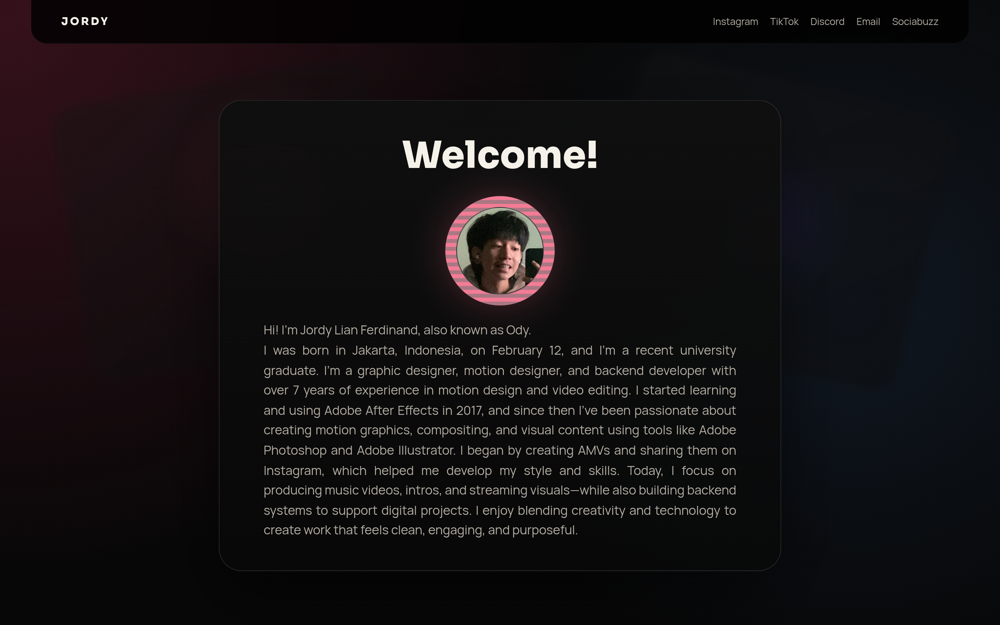

# penyuunsada Design System

You are building UI for **penyuunsada**. Light-themed, warm palette, sans-serif typography (Manrope), compact density on a 4px grid.

## Visual Reference

**IMPORTANT**: Study ALL screenshots below before writing any UI. Match colors, typography, spacing, layout, and motion exactly as shown.

### Homepage



> Read `references/DESIGN.md` for full token details.

## Design Philosophy

- **Layered depth** — use shadow tokens to create a sense of physical layering. Each elevation level has a specific shadow.
- **Gradient accents** — gradients are used thoughtfully for emphasis, not decoration.
- **Type pairing** — Manrope for body/UI text, Sora for headings/display. Never introduce a third typeface.
- **compact density** — 4px base grid. Every dimension is a multiple of 4.
- **warm palette** — the color temperature runs warm, matching the sans-serif typography.
- **Restrained accent** — `#ff6f91` is the only pop of color. Used exclusively for CTAs, links, focus rings, and active states.
- **Subtle motion** — transitions smooth state changes. Keep durations under 300ms, use ease-out curves.

## Color System

### Core Palette

| Role | Token | Hex | Use |
|------|-------|-----|-----|
| Background | `--background` | `#ffffff` | Page/app background |
| Surface | `--surface` | `#f5f2ea` | Cards, panels, modals |
| Text Primary | `--text-primary` | `#080808` | Headings, body text |
| Text Muted | `--text-muted` | `#b6b0a5` | Captions, placeholders |
| Accent | `--accent` | `#ff6f91` | CTAs, links, focus rings |
| Border | `--border` | `#252525` | Dividers, card borders |

### Status Colors

| Status | Hex | Use |
|--------|-----|-----|
| Danger | `#ff819c` | Errors, destructive actions |

### Extended Palette

- `#6d1b32`
- `#2a4a74`
- `#664eff`
- `#111111` — Deep background layer or shadow color

### CSS Variable Tokens

```css
--border: rgba(255,255,255,0.1);
--muted: #b6b0a5;
--accent: #ff6f91;
--accent-soft: rgba(255,111,145,0.25);
```

## Typography

### Font Stack

- **Manrope** — Heading 1, Heading 2, Heading 3
- **Sora** — Body, Caption

### Font Sources

```css
@font-face {
  font-family: "Manrope";
  src: url("fonts/Manrope-Bold.ttf") format("truetype");
  font-weight: 700;
}
@font-face {
  font-family: "Manrope";
  src: url("fonts/Manrope-Regular.ttf") format("truetype");
  font-weight: 400;
}
@font-face {
  font-family: "Sora";
  src: url("fonts/Sora-Bold.ttf") format("truetype");
  font-weight: 700;
}
@font-face {
  font-family: "Sora";
  src: url("fonts/Sora-Regular.ttf") format("truetype");
  font-weight: 400;
}
```

### Type Scale

| Role | Family | Size | Weight |
|------|--------|------|--------|
| Heading 1 | Manrope | clamp(2rem,4vw,3rem) | 700 |
| Heading 2 | Manrope | clamp(2rem,4vw,2.8rem) | 700 |
| Heading 3 | Manrope | clamp(1.7rem,4vw,2.3rem) | 700 |
| Body | Sora | 0.8rem | 400 |
| Caption | Sora | 0.85rem | 400 |

### Typography Rules

- Body/UI: **Manrope**, Headings: **Sora** — these are the only display fonts
- Max 3-4 font sizes per screen
- Headings: weight 600-700, body: weight 400
- Use color and opacity for text hierarchy, not additional font sizes
- Line height: 1.5 for body, 1.2 for headings

## Spacing & Layout

### Base Grid: 4px

Every dimension (margin, padding, gap, width, height) must be a multiple of **4px**.

### Spacing Scale

`4, 6, 10, 12, 14, 16, 18, 22, 24, 26, 32, 38` px

### Spacing as Meaning

| Spacing | Use |
|---------|-----|
| 4-8px | Tight: related items (icon + label, avatar + name) |
| 12-16px | Medium: between groups within a section |
| 24-32px | Wide: between distinct sections |
| 48px+ | Vast: major page section breaks |

### Border Radius

Scale: `1rem, 1.1rem, 1.2rem, 1.5rem, 1.7rem, 1.8rem, 2rem, 999px`
Default: `1.7rem`

### Container

Max-width: `1024px`, centered with auto margins.

### Breakpoints

| Name | Value |
|------|-------|
| sm | 560px |
| lg | 820px |
| lg | 1024px |

Mobile-first: design for small screens, layer on responsive overrides.

## Component Patterns

### Card

```css
.card {
  background: #f5f2ea;
  border: 1px solid #252525;
  border-radius: 1.7rem;
  padding: 16px;
  box-shadow: var(--shadow);
}
```

```html
<div class="card">
  <h3>Card Title</h3>
  <p>Card content goes here.</p>
</div>
```

### Button

```css
/* Primary */
.btn-primary {
  background: #ff6f91;
  color: #080808;
  border-radius: 1.7rem;
  padding: 6px 16px;
  font-weight: 500;
  transition: opacity 150ms ease;
}
.btn-primary:hover { opacity: 0.9; }

/* Ghost */
.btn-ghost {
  background: transparent;
  border: 1px solid #252525;
  color: #080808;
  border-radius: 1.7rem;
  padding: 6px 16px;
}
```

```html
<button class="btn-primary">Get Started</button>
<button class="btn-ghost">Learn More</button>
```

### Input

```css
.input {
  background: #ffffff;
  border: 1px solid #252525;
  border-radius: 1.7rem;
  padding: 6px 12px;
  color: #080808;
  font-size: 14px;
}
.input:focus { border-color: #ff6f91; outline: none; }
```

```html
<input class="input" type="text" placeholder="Search..." />
```

### Badge / Chip

```css
.badge {
  display: inline-flex;
  align-items: center;
  padding: 4px 6px;
  border-radius: 9999px;
  font-size: 12px;
  font-weight: 500;
  background: #f5f2ea;
  color: #b6b0a5;
}
```

```html
<span class="badge">New</span>
<span class="badge">Beta</span>
```

### Modal / Dialog

```css
.modal-backdrop { background: rgba(0, 0, 0, 0.6); }
.modal {
  background: #f5f2ea;
  border: 1px solid #252525;
  border-radius: 999px;
  padding: 24px;
  max-width: 480px;
  width: 90vw;
  box-shadow: 0 0 45px rgba(255,111,145,0.25);
}
```

```html
<div class="modal-backdrop">
  <div class="modal">
    <h2>Dialog Title</h2>
    <p>Dialog content.</p>
    <button class="btn-primary">Confirm</button>
    <button class="btn-ghost">Cancel</button>
  </div>
</div>
```

### Table

```css
.table { width: 100%; border-collapse: collapse; }
.table th {
  text-align: left;
  padding: 6px 12px;
  font-weight: 500;
  font-size: 12px;
  color: #b6b0a5;
  text-transform: uppercase;
  letter-spacing: 0.05em;
  border-bottom: 1px solid #252525;
}
.table td {
  padding: 12px;
  border-bottom: 1px solid #252525;
}
```

```html
<table class="table">
  <thead><tr><th>Name</th><th>Status</th><th>Date</th></tr></thead>
  <tbody>
    <tr><td>Item One</td><td>Active</td><td>Jan 1</td></tr>
    <tr><td>Item Two</td><td>Pending</td><td>Jan 2</td></tr>
  </tbody>
</table>
```

### Navigation

```css
.nav {
  display: flex;
  align-items: center;
  gap: 6px;
  padding: 12px 16px;
  border-bottom: 1px solid #252525;
}
.nav-link {
  color: #b6b0a5;
  padding: 6px 12px;
  border-radius: 1.7rem;
  transition: color 150ms;
}
.nav-link:hover { color: #080808; }
.nav-link.active { color: #ff6f91; }
```

```html
<nav class="nav">
  <a href="/" class="nav-link active">Home</a>
  <a href="/about" class="nav-link">About</a>
  <a href="/pricing" class="nav-link">Pricing</a>
  <button class="btn-primary" style="margin-left: auto">Get Started</button>
</nav>
```

## Page Structure

The following page sections were detected:

- **Navigation** — Top navigation bar (5 items)
- **Hero** — Hero/banner section with headline and CTAs
- **Features** — Feature/benefit cards grid (1 items)

When building pages, follow this section order and structure.

## Animation & Motion

This project uses **subtle motion**. Transitions smooth state changes without calling attention.

### Motion Tokens

- **Duration scale:** `180ms`
- **Easing functions:** `ease`
- **Animated properties:** `color`, `transform`

### Motion Guidelines

- **Duration:** Use values from the duration scale above. Short (180ms) for micro-interactions, long (180ms) for page transitions
- **Easing:** Use `ease` as the default easing curve
- **Direction:** Elements enter from bottom/right, exit to top/left
- **Reduced motion:** Always respect `prefers-reduced-motion` — disable animations when set

## Depth & Elevation

### Shadow Tokens

- Raised (cards, buttons): `var(--shadow)`
- Overlay (modals, dialogs): `0 0 45px rgba(255,111,145,0.25)`

### Z-Index Scale

`1, 40`

Use these exact values — never invent z-index values.

## Anti-Patterns (Never Do)

- **No blur effects** — no backdrop-blur, no filter: blur()
- **No zebra striping** — tables and lists use borders for separation
- **No invented colors** — every hex value must come from the palette above
- **No arbitrary spacing** — every dimension is a multiple of 4px
- **No extra fonts** — only Manrope and Sora are allowed
- **No arbitrary border-radius** — use the scale: 1rem, 1.1rem, 1.2rem, 1.5rem, 1.7rem, 1.8rem, 2rem, 999px
- **No opacity for disabled states** — use muted colors instead

## Workflow

1. **Read** `references/DESIGN.md` before writing any UI code
2. **Pick colors** from the Color System section — never invent new ones
3. **Set typography** — Manrope, Sora only, using the type scale
4. **Build layout** on the 4px grid — check every margin, padding, gap
5. **Match components** to patterns above before creating new ones
6. **Apply elevation** — use shadow tokens
7. **Validate** — every value traces back to a design token. No magic numbers.

## Brand Spec

- **Favicon:** `/favicon.ico`
- **Site URL:** `https://penyuunsada.my.id/portfoliojordy/#/`
- **Brand color:** `#ff6f91`
- **Brand typeface:** Manrope

## Quick Reference

```
Background:     #ffffff
Surface:        #f5f2ea
Text:           #080808 / #b6b0a5
Accent:         #ff6f91
Border:         #252525
Font:           Manrope
Spacing:        4px grid
Radius:         1.7rem
Components:     4 detected
```

## When to Trigger

Activate this skill when:
- Creating new components, pages, or visual elements for penyuunsada
- Writing CSS, Tailwind classes, styled-components, or inline styles
- Building page layouts, templates, or responsive designs
- Reviewing UI code for design consistency
- The user mentions "penyuunsada" design, style, UI, or theme
- Generating mockups, wireframes, or visual prototypes

---

# Full Reference Files

> Every output file is embedded below. Claude has full design system context from /skills alone.

## Design System Tokens (DESIGN.md)

# penyuunsada DESIGN.md

> Auto-generated design system — reverse-engineered via static analysis by skillui.
> Frameworks: None detected
> Colors: 12 · Fonts: 2 · Components: 4
> Icon library: not detected · State: not detected
> Primary theme: light · Dark mode toggle: no · Motion: subtle

## Visual Reference

**Match this design exactly** — study colors, fonts, spacing, and component shapes before writing any UI code.


---

## 1. Visual Theme & Atmosphere

This is a **light-themed** interface with a warm, approachable feel. The light background emphasizes content clarity. Typography pairs **Sora** for display/headings with **Manrope** for body text, creating clear visual hierarchy through type contrast. Spacing follows a **4px base grid** (compact density), with scale: 4, 6, 10, 12, 14, 16, 18, 22px. The accent color **#ff6f91** anchors interactive elements (buttons, links, focus rings). Motion is subtle — smooth transitions (150-300ms) ease state changes without drawing attention.

---

## 2. Color Palette & Roles

| Token | Hex | Role | Use |
|---|---|---|---|
| border | `#ffffff` | background | Page background, darkest surface |
| text | `#f5f2ea` | surface | Card and panel backgrounds |
| text-primary | `#080808` | text-primary | Headings and body text |
| muted | `#b6b0a5` | text-muted | Captions, placeholders, secondary info |
| border | `#252525` | border | Dividers, card borders, outlines |
| accent | `#ff6f91` | accent | CTAs, links, focus rings, active states |
| accent | `#ffb1c2` | accent | CTAs, links, focus rings, active states |
| danger | `#ff819c` | danger | Error states, destructive actions |
| info | `#2a4a74` | info | Informational highlights |
| unknown | `#6d1b32` | unknown | Palette color |
| unknown | `#664eff` | unknown | Palette color |
| unknown | `#111111` | unknown | Palette color |

### CSS Variable Tokens

```css
--border: rgba(255,255,255,0.1);
--muted: #b6b0a5;
--accent: #ff6f91;
--accent-soft: rgba(255,111,145,0.25);
```


---

## 3. Typography Rules

**Font Stack:**
- **Manrope** — Heading 1, Heading 2, Heading 3
- **Sora** — Body, Caption

**Font Sources:**

```css
@font-face {
  font-family: "Manrope";
  src: url("fonts/Manrope-Bold.ttf") format("truetype");
  font-weight: 700;
}
@font-face {
  font-family: "Manrope";
  src: url("fonts/Manrope-Regular.ttf") format("truetype");
  font-weight: 400;
}
@font-face {
  font-family: "Sora";
  src: url("fonts/Sora-Bold.ttf") format("truetype");
  font-weight: 700;
}
@font-face {
  font-family: "Sora";
  src: url("fonts/Sora-Regular.ttf") format("truetype");
  font-weight: 400;
}
```

| Role | Font | Size | Weight |
|---|---|---|---|
| Heading 1 | Manrope | clamp(2rem,4vw,3rem) | 700 |
| Heading 2 | Manrope | clamp(2rem,4vw,2.8rem) | 700 |
| Heading 3 | Manrope | clamp(1.7rem,4vw,2.3rem) | 700 |
| Body | Sora | 0.8rem | 400 |
| Caption | Sora | 0.85rem | 400 |

**Typographic Rules:**
- Limit to 2 font families max per screen
- Use **Manrope** for body/UI text, **Sora** for display/headings
- Maintain consistent hierarchy: no more than 3-4 font sizes per screen
- Headings use bold (600-700), body uses regular (400)
- Line height: 1.5 for body text, 1.2 for headings
- Use color and opacity for secondary hierarchy, not additional font sizes


---

## 4. Component Stylings

### Navigation (1)

**Navigation** — `html`

### Data Display (1)

**List** — `html`

### Data Input (1)

**Button** — `html`
- Animation: 

### Overlay (1)

**Modal** — `html`


---

## 5. Layout Principles

- **Base spacing unit:** 4px
- **Spacing scale:** 4, 6, 10, 12, 14, 16, 18, 22, 24, 26, 32, 38
- **Border radius:** 1rem, 1.1rem, 1.2rem, 1.5rem, 1.7rem, 1.8rem, 2rem, 999px
- **Max content width:** 1024px

**Spacing as Meaning:**
| Spacing | Use |
|---|---|
| 4-8px | Tight: related items within a group |
| 12-16px | Medium: between groups |
| 24-32px | Wide: between sections |
| 48px+ | Vast: major section breaks |


---

## 6. Depth & Elevation

### Raised — cards, buttons, interactive elements

- `var(--shadow)`

### Overlay — full-screen overlays, top-level dialogs

- `0 0 45px rgba(255,111,145,0.25)`

### Z-Index Scale

`1, 40`


---

## 7. Animation & Motion

This project uses **subtle motion**. Transitions smooth state changes without demanding attention.

### Animated Components

- **Button**: 

### Motion Guidelines

- Duration: 150-300ms for micro-interactions, 300-500ms for page transitions
- Easing: `ease-out` for enters, `ease-in` for exits
- Always respect `prefers-reduced-motion`


---

## 8. Do's and Don'ts

### Do's

- Use `#ff6f91` for interactive elements (buttons, links, focus rings)
- Use `#ffffff` as the primary page background
- Pair **Manrope** (body) with **Sora** (display) — these are the only allowed fonts
- Follow the **4px** spacing grid for all margins, padding, and gaps
- Use the defined shadow tokens for elevation — see Section 6
- Use border-radius from the scale: 1rem, 1.1rem, 1.2rem, 1.5rem, 1.7rem
- Reuse existing components from Section 4 before creating new ones

### Don'ts

- Don't introduce colors outside this palette — extend the design tokens first
- Don't introduce additional font families beyond Manrope and Sora
- Don't use arbitrary spacing values — stick to multiples of 4px
- Don't create custom box-shadow values outside the system tokens
- Don't use arbitrary border-radius values — pick from the defined scale
- Don't duplicate component patterns — check Section 4 first
- Don't use backdrop-blur or blur effects

### Anti-Patterns (detected from codebase)

- No blur or backdrop-blur effects
- No zebra striping on tables/lists


---

## 9. Responsive Behavior

| Name | Value | Source |
|---|---|---|
| sm | 560px | css |
| lg | 820px | css |
| lg | 1024px | css |

**Approach:** Use `@media (min-width: ...)` queries matching the breakpoints above.


---

## 10. Agent Prompt Guide

Use these as starting points when building new UI:

### Build a Card

```
Background: #f5f2ea
Border: 1px solid #252525
Radius: 1.7rem
Padding: 16px
Font: Manrope
Use shadow tokens from Section 6.
```

### Build a Button

```
Primary: bg #ff6f91, text white
Ghost: bg transparent, border #252525
Padding: 6px 16px
Radius: 1.7rem
Hover: opacity 0.9 or lighter shade
Focus: ring with #ff6f91
```

### Build a Page Layout

```
Background: #ffffff
Max-width: 1024px, centered
Grid: 4px base
Responsive: mobile-first, breakpoints from Section 9
```

### Build a Stats Card

```
Surface: #f5f2ea
Label: #b6b0a5 (muted, 12px, uppercase)
Value: #080808 (primary, 24-32px, bold)
Status: use success/warning/danger from Section 2
```

### Build a Form

```
Input bg: #ffffff
Input border: 1px solid #252525
Focus: border-color #ff6f91
Label: #b6b0a5 12px
Spacing: 16px between fields
Radius: 1.7rem
```

### General Component

```
1. Read DESIGN.md Sections 2-6 for tokens
2. Colors: only from palette
3. Font: Manrope, type scale from Section 3
4. Spacing: 4px grid
5. Components: match patterns from Section 4
6. Elevation: shadow tokens
```

## Bundled Fonts (fonts/)

The following font files are bundled in the `fonts/` directory:

- `fonts/Manrope-Bold.ttf`
- `fonts/Manrope-ExtraBold.ttf`
- `fonts/Manrope-ExtraLight.ttf`
- `fonts/Manrope-Light.ttf`
- `fonts/Manrope-Medium.ttf`
- `fonts/Manrope-Regular.ttf`
- `fonts/Manrope-SemiBold.ttf`
- `fonts/Sora-Bold.ttf`
- `fonts/Sora-ExtraBold.ttf`
- `fonts/Sora-ExtraLight.ttf`
- `fonts/Sora-Light.ttf`
- `fonts/Sora-Medium.ttf`
- `fonts/Sora-Regular.ttf`
- `fonts/Sora-SemiBold.ttf`
- `fonts/Sora-Thin.ttf`

Use these local font files in `@font-face` declarations instead of fetching from Google Fonts.

## Homepage Screenshots (screenshots/)


